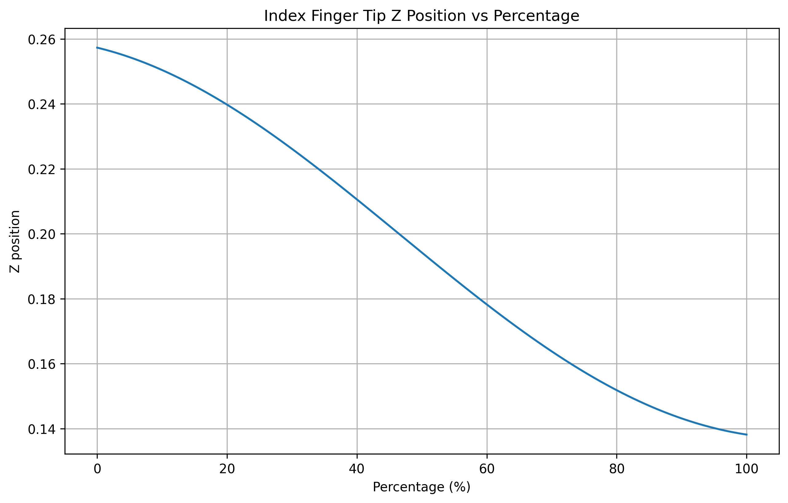
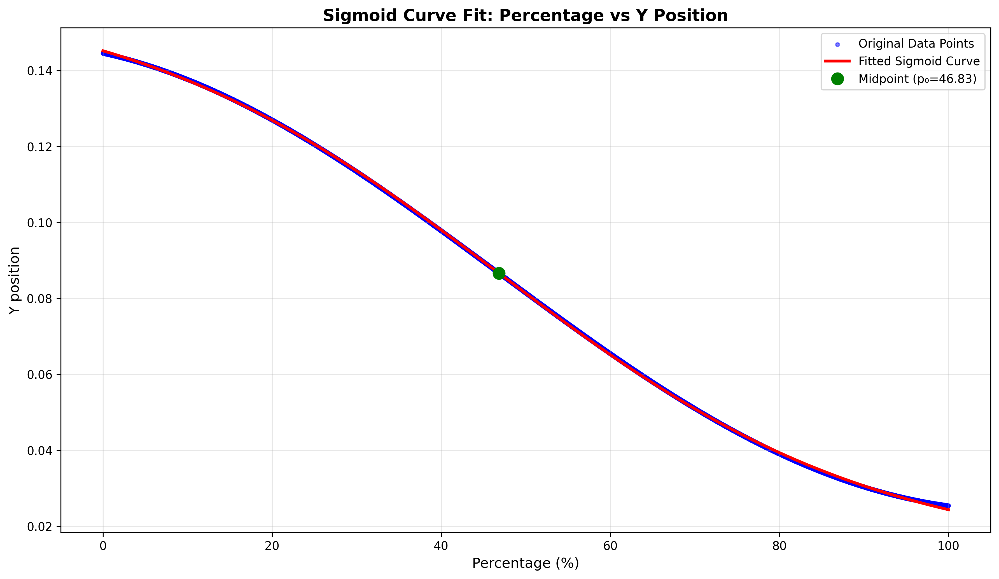
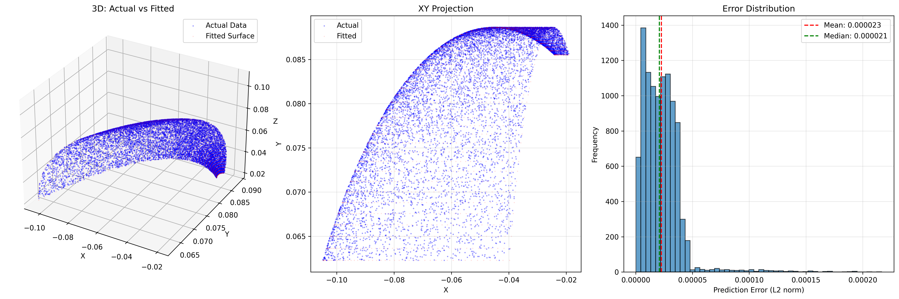

# Inspire SDK - RH56 Robot Hand Controller

Python SDK for controlling the RH56 dexterous robot hand with optional wrist control.

## Installation

```bash
pip install pyserial
```

## Hand Operator (Inverse Kinematics)

The `InspireHandOperator` provides inverse kinematics to control the hand using fingertip target positions in 3D space.

### Usage

```python
from hand_operator import InspireHandOperator
import numpy as np

# Initialize operator (connects to hand automatically)
operator = InspireHandOperator(
    port='/dev/ttyUSB0',
    hand_id=1,
    forces=[40] * 6,
    speeds=[100] * 6
)

# Control hand using fingertip target positions (5 fingers × 3D coordinates)
# Order: index, middle, ring, pinky, thumb
target_positions = np.array([
    [0.1, 0.05, 0.02],  # index fingertip (x, y, z)
    [0.1, 0.03, 0.02],  # middle fingertip
    [0.1, 0.01, 0.02],  # ring fingertip
    [0.1, -0.01, 0.02], # pinky fingertip
    [0.08, 0.02, 0.03], # thumb fingertip
])

motor_angles = operator.step(target_positions)

# Convert motor angles to joint angles
joint_angles = operator.motor_to_joint(motor_angles)

# Reset hand to fully closed position
operator.reset()
```

### How Operator IK Works

The operator uses a two-stage inverse kinematics approach:

1. **Workspace Projection**: Target fingertip positions are projected to the nearest reachable point on learned fingertip workspaces (polynomial curves for 4 fingers, quadratic surface for thumb).



2. **Regression Mapping**: Projected positions are converted to motor control ratios using learned regression models:
   - **4 Fingers**: Sigmoid regression maps z-position to DOF ratio
   - **Thumb**: Polynomial 2D regression maps (x,y,z) to two DOF ratios




The operator automatically handles the conversion from fingertip space to motor angles and sends commands to the hand.

## Quick Start

### Hand Only (RH56RobotHand)

```python
from hand_sdk import RH56RobotHand

# Connect to hand
hand = RH56RobotHand(port='/dev/ttyUSB0', baudrate=115200, hand_id=1)
hand.connect()

# Set all fingers to 50% closed
hand.set_speeds([50] * 6)
hand.set_angles([50] * 6)

# Control individual finger
hand.set_finger(0, 75, speed=80)  # Finger 0 to 75% closed at 80% speed

# Read sensor data
angles = hand.get_angles()
forces = hand.get_forces()
state = hand.get_state()

# Quick actions
hand.open_hand(speed=50)
hand.close_hand(speed=50, force=50)

hand.disconnect()
```

### Hand with Wrist (RH56RobotHandWithWrist)

```python
from wrist_hand_sdk import RH56RobotHandWithWrist

# Connect to hand with wrist
hand = RH56RobotHandWithWrist(port='/dev/ttyUSB0', baudrate=115200, hand_id=1)
hand.connect()

# Control hand
hand.set_angles([50] * 6)
hand.set_speeds([50] * 6)

# Control wrist (pitch: -22.66° to 22.12°, yaw: -25.50° to 25.50°)
hand.set_wrist_angles(pitch=10.0, yaw=5.0, movement_time_ms=1000)
hand.center_wrist()

# Read wrist state
wrist_state = hand.get_wrist_state()
angles = hand.get_wrist_angles()  # Returns (pitch, yaw)

hand.disconnect()
```

### Context Manager

```python
with RH56RobotHand(port='/dev/ttyUSB0') as hand:
    hand.set_angles([100] * 6)
    time.sleep(2)
    hand.open_hand()
```

## API Reference

### RH56RobotHand

**Connection:**

- `connect() -> bool` - Open serial connection
- `disconnect()` - Close connection

**Control:**

- `set_angles(angles: List[float])` - Set all 6 finger angles (0-100%, 0=open, 100=closed)
- `set_speeds(speeds: List[float])` - Set movement speeds (0-100%)
- `set_forces(forces: List[float])` - Set grip forces (0-100%)
- `set_finger(index: int, angle: float, speed: float)` - Control single finger

**Reading:**

- `get_angles() -> List[float]` - Get current finger angles
- `get_forces() -> List[float]` - Get current forces
- `get_temperatures() -> List[int]` - Get motor temperatures
- `get_state() -> HandState` - Get complete hand state

**Convenience:**

- `open_hand(speed=50)` - Fully open hand
- `close_hand(speed=50, force=50)` - Fully close hand
- `clear_errors()` - Clear error codes

### RH56RobotHandWithWrist

**Wrist Control:**

- `set_wrist_angles(pitch: float, yaw: float, movement_time_ms=1000)` - Set both wrist angles
- `set_wrist_pitch(pitch: float, movement_time_ms=1000)` - Set pitch only
- `set_wrist_yaw(yaw: float, movement_time_ms=1000)` - Set yaw only
- `center_wrist(movement_time_ms=1000)` - Center wrist to (0°, 0°)

**Wrist Reading:**

- `get_wrist_angles() -> Tuple[float, float]` - Returns (pitch, yaw)
- `get_wrist_state() -> WristState` - Get complete wrist state

**Joint Angles (for kinematics):**

- `set_joint_angles(joint_angles: List[float])` - Set joint space angles
- `joint_angles_to_motor_angles(joint_angles: List[float])` - Convert joint to motor angles

## GUI Applications

**Tkinter GUI (hand only):**

```bash
python hand_terminal.py
```

**Web Interface (hand + wrist):**

```bash
python wrist_hand_terminal.py
# Open http://localhost:5000 in browser
```
